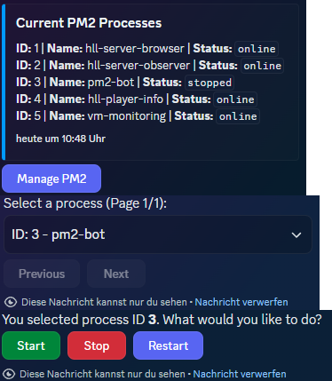

# Discord PM2 Manager

A Discord bot that provides a live-updating embed to monitor and manage PM2 processes via an interactive button interface. No slash commands—just a clean, embed-driven experience.

## Features
- **Live Process Monitoring**: Displays an embed with PM2 process IDs, names, and statuses, updated every 30 seconds.
- **Interactive Management**: Use the "Manage PM2" button to access a paginated dropdown menu for selecting processes.
- **Process Control**: Start, stop, or restart individual processes with dedicated buttons.
- **Channel Cleanup**: Automatically clears the specified channel on startup for a clutter-free interface.



## Prerequisites
- **Node.js**: Version 16 or higher.
- **Discord Bot Token**: Obtainable from the [Discord Developer Portal](https://discord.com/developers/applications).
- **PM2**: Installed globally (`npm install -g pm2`) to manage your processes.

## Installation
1. **Clone the Repository**:
   ```bash
   git clone https://github.com/2KU77B0N3S/pm2-discord-manager.git
   cd discord-pm2-manager

2. **Install Dependencies**:
   ```bash
   npm install

3. **Configure Environment**:
Create a .env file in the root directory.
Add the following:
```
DISCORD_TOKEN=your-discord-bot-token
PM2_CHANNEL_ID=your-channel-id
```
Replace your-discord-bot-token with your bot’s token and your-channel-id with the ID of the Discord channel where the embed should appear.
4. **Start the Bot**:
```npm start```
## Usage
1. **Invite the Bot**:
   - Add the bot to your Discord server via the Developer Portal.
   - Ensure it has permissions to send messages, embed content, and manage messages in the configured channel.

2. **Monitor Processes**:
   - On startup, the bot clears the specified channel and posts an embed displaying all running PM2 processes.
   - The embed updates every 30 seconds to reflect live statuses (e.g., `online`, `stopped`, `errored`).

3. **Manage Processes**:
   - Click the "Manage PM2" button below the embed.
   - Use the paginated dropdown to select a process (25 processes per page).
   - Choose "Start", "Stop", or "Restart" from the action buttons that appear.

## Configuration
The bot relies on two environment variables:
- `DISCORD_TOKEN`: Your bot’s authentication token.
- `PM2_CHANNEL_ID`: The ID of the Discord channel where the bot will operate.

To find a channel ID:
- Enable Developer Mode in Discord (User Settings > Appearance > Developer Mode).
- Right-click the channel and select "Copy ID".

## Dependencies
- `discord.js`: For interacting with the Discord API.
- `dotenv`: For loading environment variables.
- `pm2`: For managing and querying PM2 processes.

See `package.json` for exact versions.

## Troubleshooting
- **Bot Doesn’t Start**: Check that your `.env` file is correctly formatted and the token is valid.
- **Embed Not Updating**: Ensure the bot has permissions to edit messages in the channel.
- **PM2 Errors**: Verify that PM2 is installed globally and processes are running.

## Contributing
Feel free to fork this repository and submit pull requests for improvements. Issues and feature requests are welcome on the GitHub Issues page.

## License
This project is licensed under the [MIT License](LICENSE).

---

*Built with ❤️*
